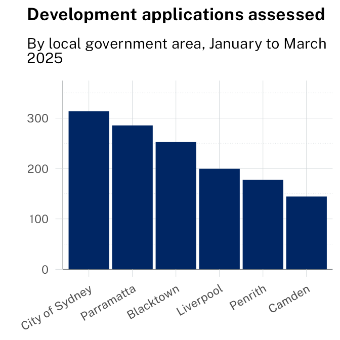
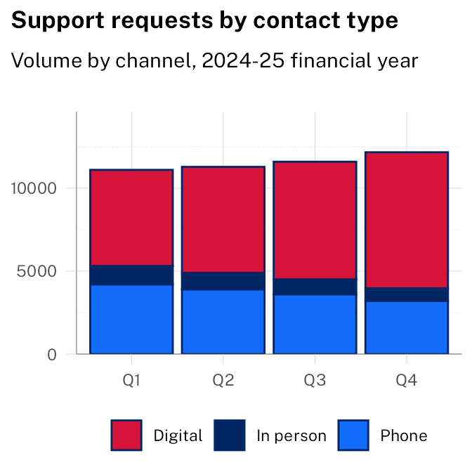
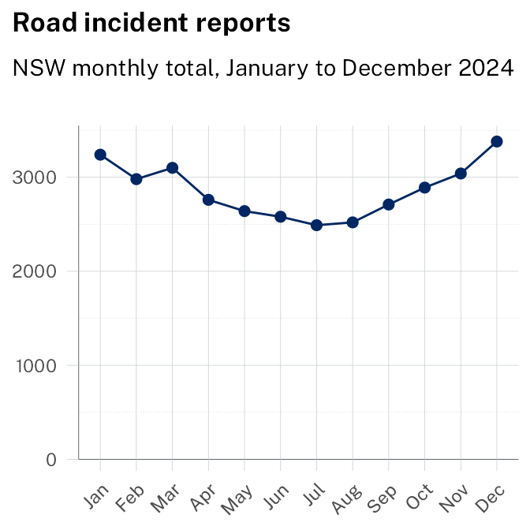
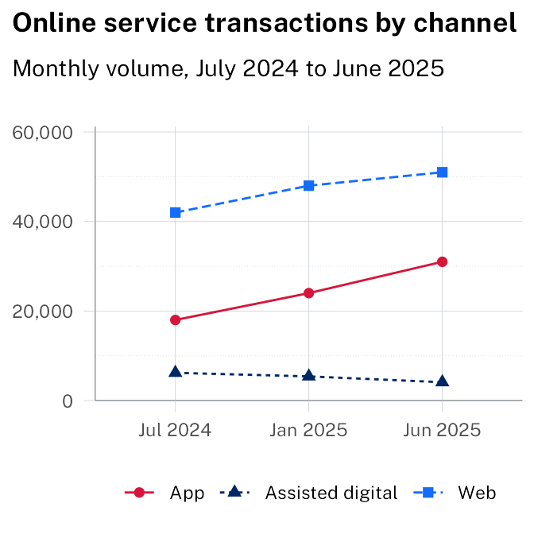
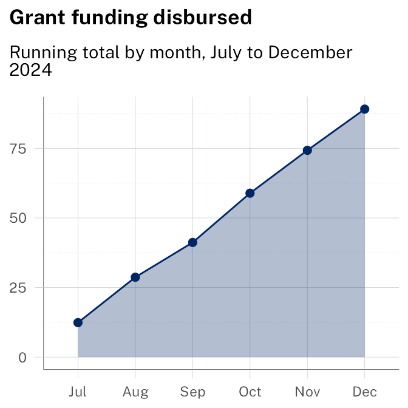
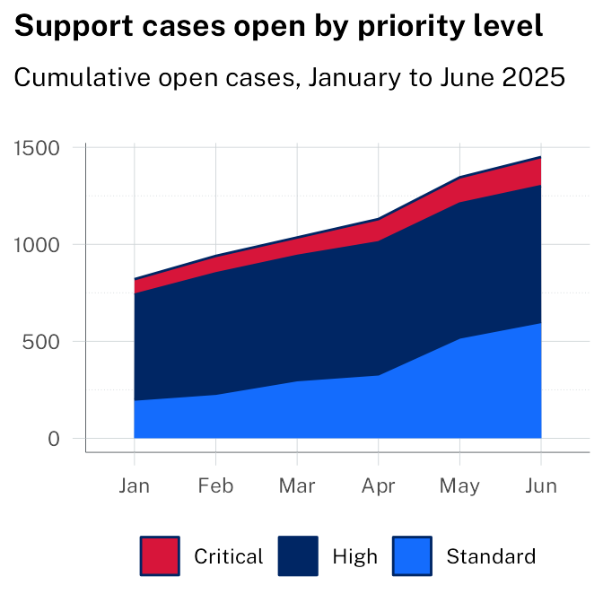
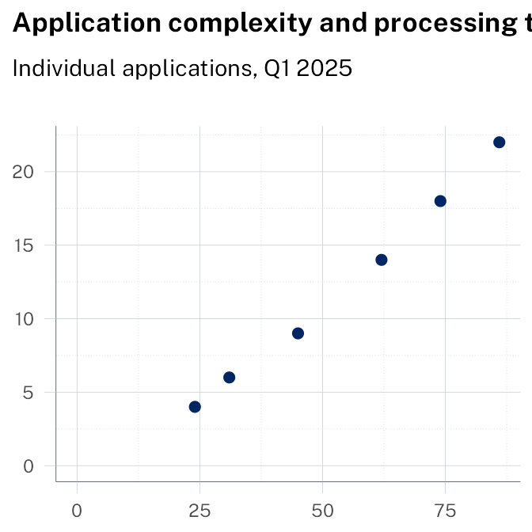

# Demonstration gallery

``` r
set_theme(
  theme_waratah(variant = "corporate") + theme(legend.position = "bottom")
)
```

Examples derived from the NSW Design System [guidance on charts and
graphs](https://designsystem.nsw.gov.au/docs/content/methods/charts-and-graphs.html).
This page is intended to demonstrate how the charts from the guidance
page look with minimal changes beyond setting the theme. There are some
inevitable differences due to different defaults in chart behaviours
between ggplot and other frameworks.

## Comparison and ranking

### Bar (vertical)



**Summary**: City of Sydney and Parramatta assessed the highest number
of applications in Q1 2025, together accounting for over a third of the
total.

**Source**: NSW Planning Portal. Last updated: March 2025.

### Stacked bar



**Summary**: Digital contact grew steadily across all four quarters,
while phone and in-person volumes declined. By Q4, digital accounted for
more than two-thirds of all requests.

**Source**: Service NSW. Last updated: June 2025.

## Trends over time

### Line



**Summary**: Incidents were highest in summer months, peaking in
December and January. July recorded the lowest monthly total for the
year.

**Source**: Transport for NSW. Last updated: December 2024.

### Multi-line



**Summary**: App transactions grew fastest over the year, nearly
doubling. Web remained the largest channel. Assisted digital declined
steadily as self-service adoption increased.

**Source**: Service NSW. Last updated: June 2025.

### Area



**Summary**: Grant disbursements accelerated from October, with the
final quarter accounting for more than half of the full-year total.

**Source**: NSW Treasury. Last updated: December 2024.

### Stacked area



**Summary**: The total number of open cases grew steadily across all
priority levels. Critical cases grew fastest proportionally, nearly
doubling between January and June.

**Source**: Service NSW. Last updated: June 2025.

## Distribution and correlation

### Scatter plot



**Summary**: Applications with higher complexity scores consistently
took longer to process. Most straightforward applications (score below
30) resolved within 5 working days. Complex applications (score above
70) averaged 18 days, with significant variation.

**Source**: NSW Planning Portal. Last updated: March 2025.
