# cookbook

This article contains some recipes for different plot styles and how to
apply waratah styles. Each example shows the base plot then the themed
version.

## Example 1: markdown text

With standard ggplot output:

``` r
library(waratah)
library(palmerpenguins)
library(ggplot2)
library(dplyr)

long_text <- paste(
  c(
    "Lorem ipsum dolor sit amet, consectetur adipiscing elit, sed do",
    "eiusmod tempor incididunt ut labore et dolore magna aliqua. Ut enim",
    "ad minim veniam, quis nostrud exercitation ullamco laboris nisi ut",
    "aliquip ex ea commodo consequat."
  ),
  collapse = " "
)

p1 <-
  ggplot(penguins) +
  geom_point(aes(
    x = bill_length_mm,
    y = flipper_length_mm,
    colour = species,
    size = body_mass_g
  )) +
  labs(
    title = "Let's try some *italics* in the title",
    subtitle = long_text,
    dictionary = c(
      bill_length_mm = "Bill length (mm)",
      flipper_length_mm = "Flipper length (mm)",
      species = "Species",
      body_mass_g = "Body mass (g)"
    ),
    caption = "Data from {palmerpenguins}"
  )

p1
#> Warning: Removed 2 rows containing missing values or values outside the scale range
#> (`geom_point()`).
```


Style with waratah:

``` r
p1 +
  theme_waratah()
#> Warning: Removed 2 rows containing missing values or values outside the scale range
#> (`geom_point()`).
```

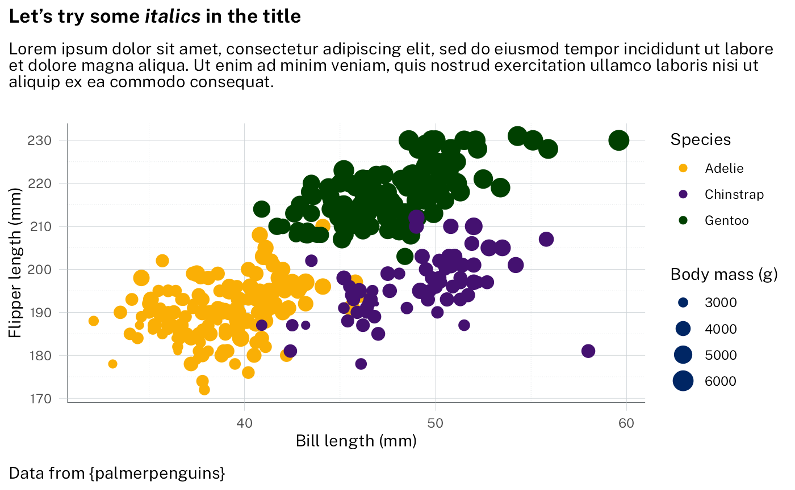

Change to a different NSW palette:

``` r
p1 +
  scale_colour_discrete(palette = pal_waratah("qual", var = "aboriginal")) +
  theme_waratah()
#> Warning: Removed 2 rows containing missing values or values outside the scale range
#> (`geom_point()`).
```

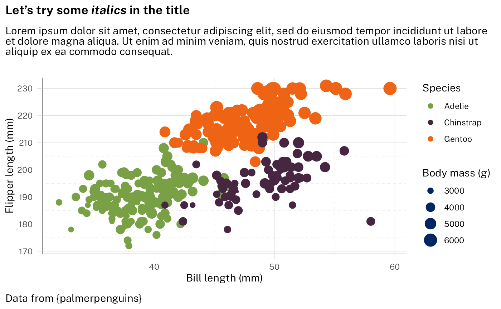

The markdown handling is done with `ggtext`. See
[`vignette("theme_elements", package = "ggtext")`](https://wilkelab.org/ggtext/articles/theme_elements.html)
for details.

## Example 2: grouped points

With standard ggplot output:

``` r
p2 <-
  filter_out(penguins, is.na(sex)) |>
  ggplot() +
  geom_point(
    aes(
      x = bill_length_mm,
      y = bill_depth_mm,
      fill = interaction(sex, species),
    ),
    shape = 21,
    size = 3,
    colour = "black",
    alpha = 0.8
  ) +
  labs(
    title = "Penguin bill dimensions",
    subtitle = "Separated by *species* and *sex*",
    dictionary = c(
      bill_length_mm = "Bill length (mm)",
      bill_depth_mm = "Bill depth (mm)"
    ),
    caption = "Data from {palmerpenguins}"
  ) +
  guides(
    fill = legendry::guide_legend_group(
      title = NULL,
      ncol = 1,
      direction = "horizontal",
      override.aes = list(size = 3)
    )
  )

p2 + scale_fill_brewer(palette = "Paired")
```

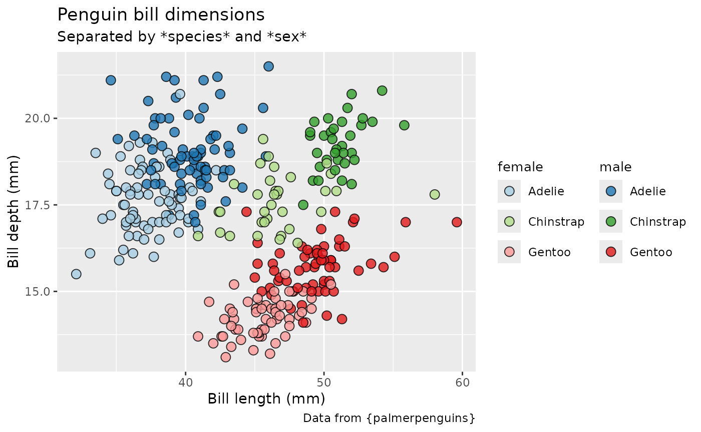

Styling using waratah package - here we want a paired colour palette:

``` r
p2 +
  discrete_scale("fill", palette = pal_waratah("pairs")) +
  theme_waratah()
```

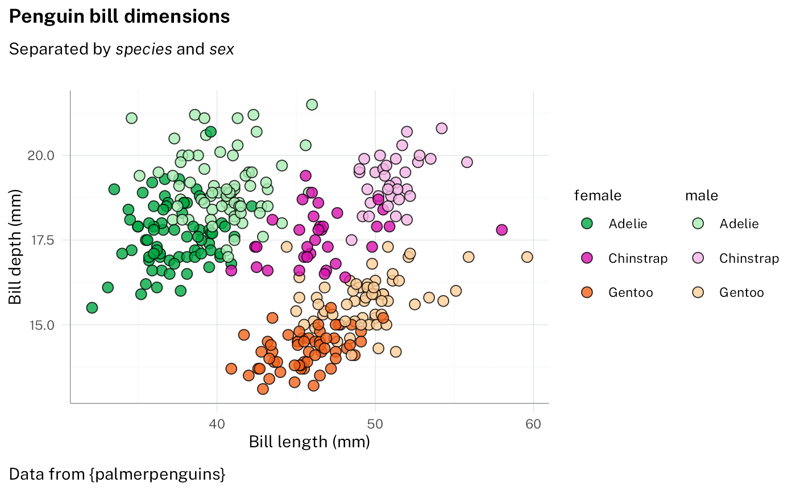

More manual control of the palette is possible, for example specifying
the rows and columns of the colour grid to use:

``` r
p2 +
  scale_fill_discrete(
    palette = pal_nsw(
      t = 2:3,
      h = c("purple", "blue", "red"),
      var = "aboriginal"
    )
  ) +
  theme_waratah(base_size = 14)
```

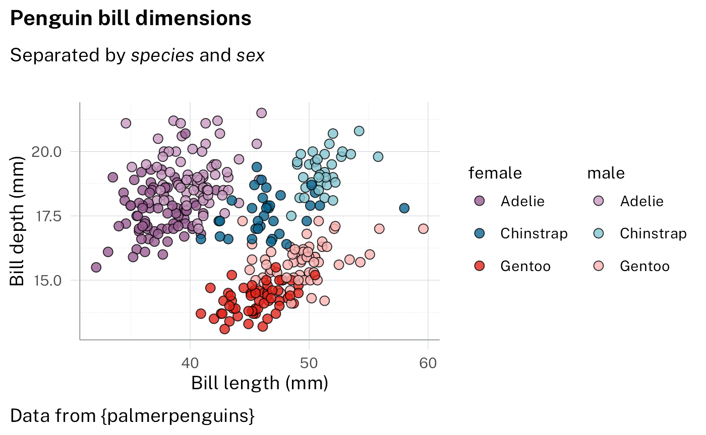

## Example 3: stacked bars

With standard ggplot output

``` r
p3 <-
  filter_out(penguins, is.na(sex)) |>
  ggplot(aes(x = species, fill = island)) +
  geom_bar() +
  labs(
    dictionary = c(species = "Species", island = "Island"),
    title = "Perfectly proportional penguins",
    subtitle = "Where do they all live?",
    caption = "Data from {palmerpenguins}"
  ) +
  facet_wrap(vars(sex))

p3
```

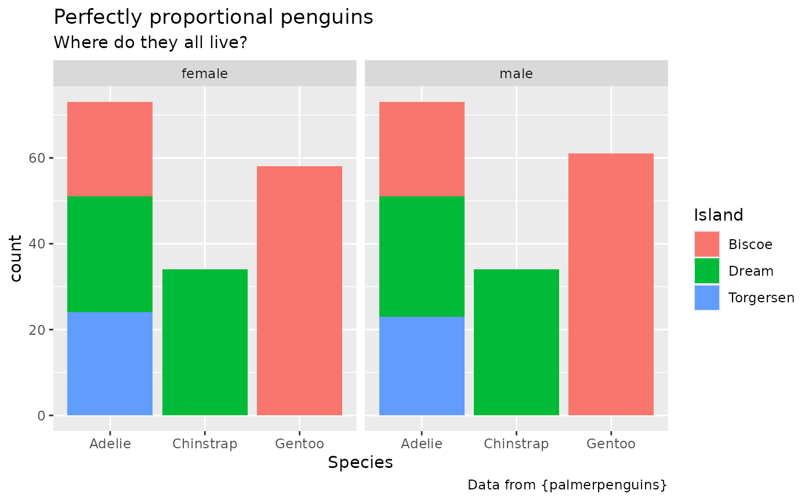

Styling using the waratah package - specifying pallete

``` r
p3 +
  scale_fill_discrete(palette = pal_nsw(hue = "purples")) +
  theme_waratah(base_size = 14) +
  guides(x = guide_axis(angle = 70)) +
  theme(panel.grid.major.x = element_blank())
```

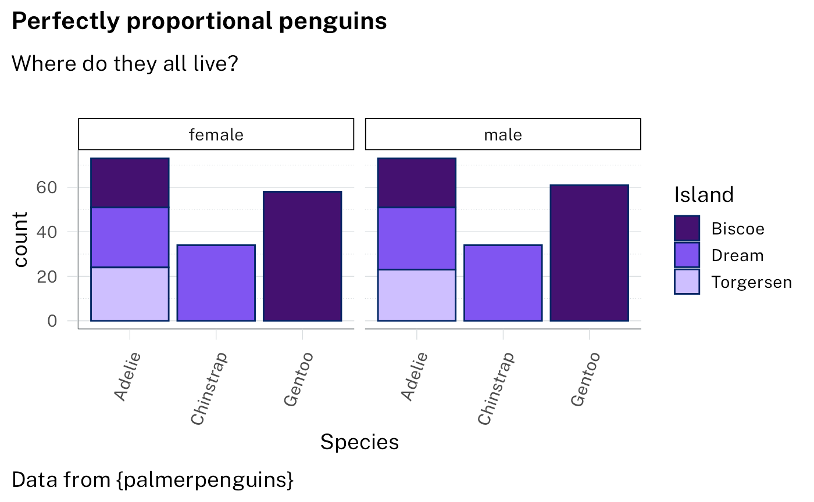

## Example 4: doughnut

With standard ggplot output:

``` r
p4 <-
  ggplot(penguins) +
  geom_bar(aes(1, fill = species)) +
  geom_text(
    aes(
      1,
      y = after_stat(count),
      label = stage(
        species,
        after_stat = sprintf("%s\n%.0f%%", label, 100 * count / sum(count))
      ),
      colour = stage(
        species,
        after_scale = col_contrasting(colour)
      )
    ),
    stat = "count",
    position = position_stack(vjust = .5),
    show.legend = FALSE
  ) +
  coord_radial(
    theta = "y",
    inner.radius = .5,
    expand = FALSE,
    rotate.angle = TRUE
  ) +
  labs(
    title = "Does anyone know if penguins like doughnuts?",
    subtitle = "Not sure, but we know there are three species in the dataset",
    caption = "Data from {palmerpenguins}"
  )

p4
```

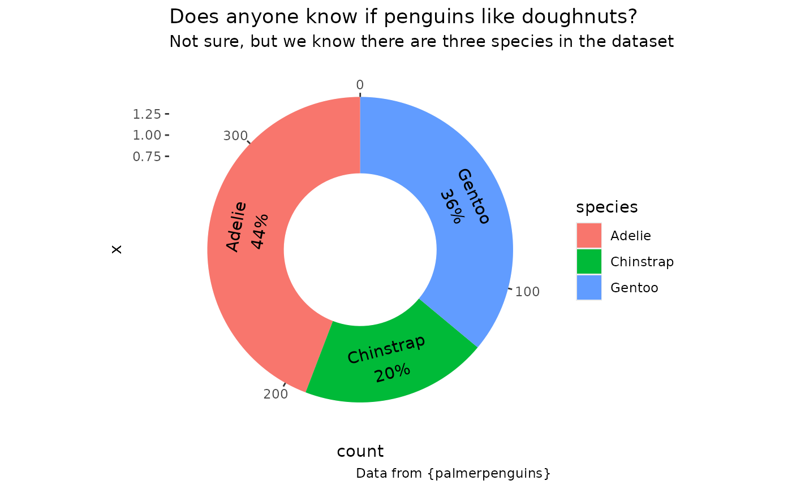

Styling using the waratah package with options:

``` r
p4 +
  scale_fill_discrete(
    aesthetics = c("fill", "colour"),
    palette = pal_waratah("qual"),
    guide = "none"
  ) +
  theme_waratah(
    void = TRUE,
    base_size = 14
  )
```

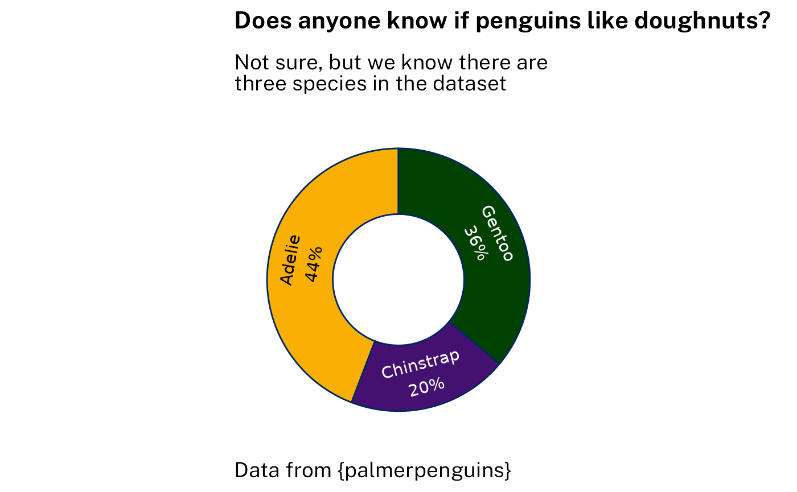

## Example 5: Likert scale

Likert-scale survey responses can be handled with dedicated tools like
`ggstats::gglikert()`. Here is a self-contained ggplot stat that
achieves a limited version of the same result for the purposes of
demonstrating styling.

``` r
StatLikert <- ggproto(
  "StatLikert",
  StatIdentity,
  compute_layer = function(self, data, params, layout) {
    mutate(
      data,
      offset = sum(x[1:(n() %/% 2)]),
      offset = if_else(
        rep(n() %% 2 > 0, n()),
        offset + x[n() %/% 2 + 1] / 2,
        offset
      ),
      left = cumsum(lag(x, default = 0)) - offset,
      right = cumsum(x) - offset,
      x = (left + right) / 2,
      width = right - left,
      .by = y
    )
  }
)
```

With standard ggplot output:

``` r
sentiment <- c(
  "Strongly Disagree",
  "Disagree",
  "Neutral",
  "Agree",
  "Strongly Agree"
)

survey_data <- tibble(
  answer = factor(rep(sentiment, 2), levels = sentiment, ordered = TRUE),
  percent = c(8, 12, 30, 40, 10, 6, 18, 24, 34, 18),
  group = sort(rep(c("Male", "Female"), 5))
)

p5 <-
  ggplot(
    survey_data,
    aes(x = percent, y = group, fill = answer)
  ) +
  geom_vline(aes(xintercept = 0, colour = from_theme(accent))) +
  # note: likert is not a standard stat - it's defined above
  geom_tile(stat = "likert", height = 0.8) +
  labs(
    title = "Let's find out!",
    subtitle = "How much do they agree with the statement \"Doughnuts are delicious\"?",
    caption = "Totally made up data!",
    x = NULL,
    y = NULL,
    fill = "Answer"
  ) +
  theme(
    panel.grid.major.y = element_blank(),
    legend.position = "bottom"
  ) +
  scale_x_continuous(labels = function(x) paste0(abs(x), "%"))

p5 + scale_fill_brewer(palette = "PiYG")
```

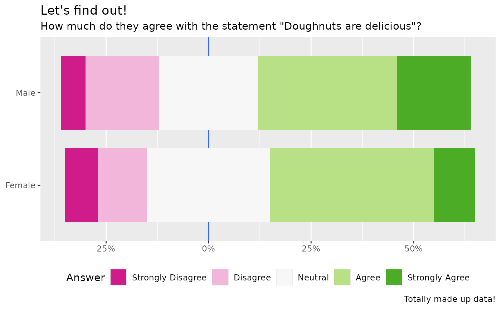

Styling using the waratah package. Note that the diverging palette is
continuous, so we need
[`pal_stretch()`](https://digitalnsw.github.io/nsw-r-visualisations/reference/ggplot_palettes.md)
to discretise it here. We specify `"red"` as our starting hue. Without
`cvd = TRUE` the second colour ends up being green.

``` r
p5 +
  discrete_scale(
    "fill",
    palette = pal_waratah("div", "red", cvd = TRUE) |> pal_stretch(),
    breaks = sentiment
  ) +
  theme_waratah(base_size = 12)
```

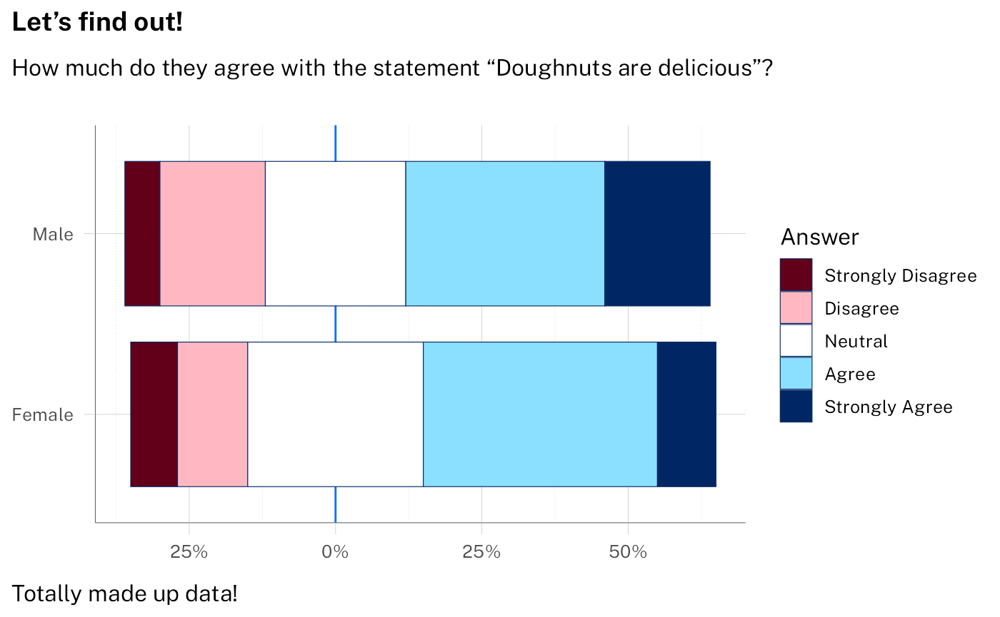
