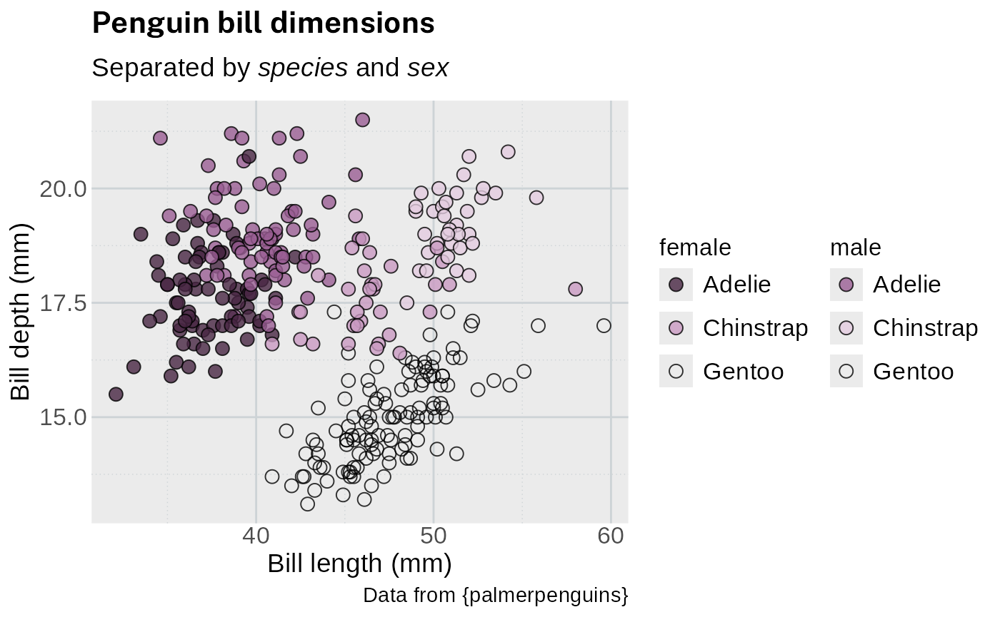
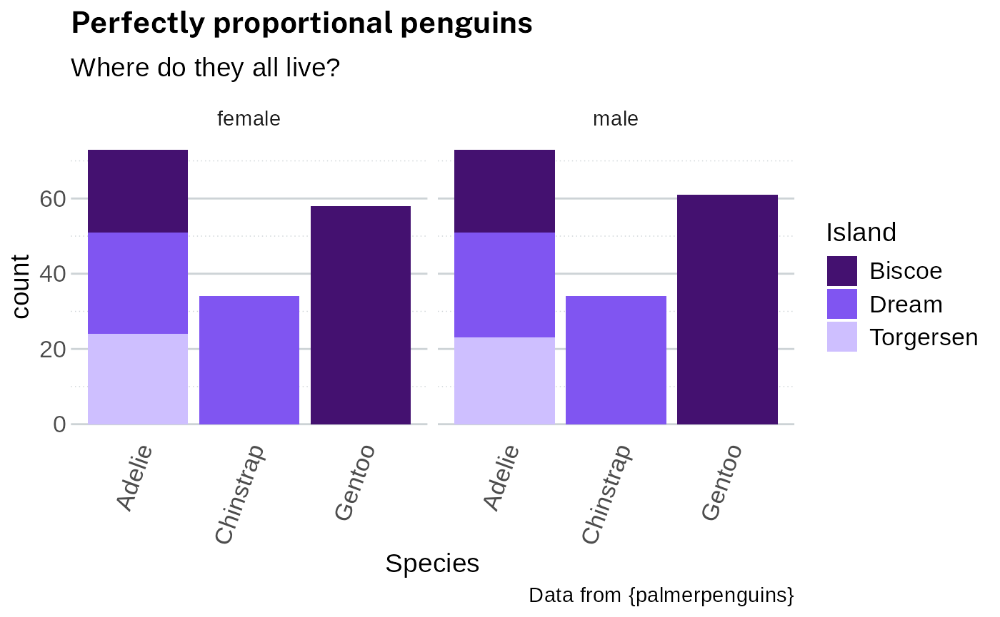
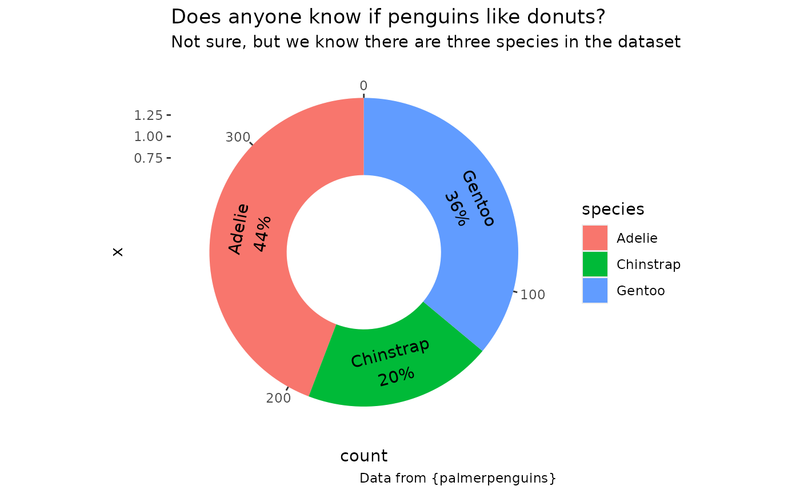
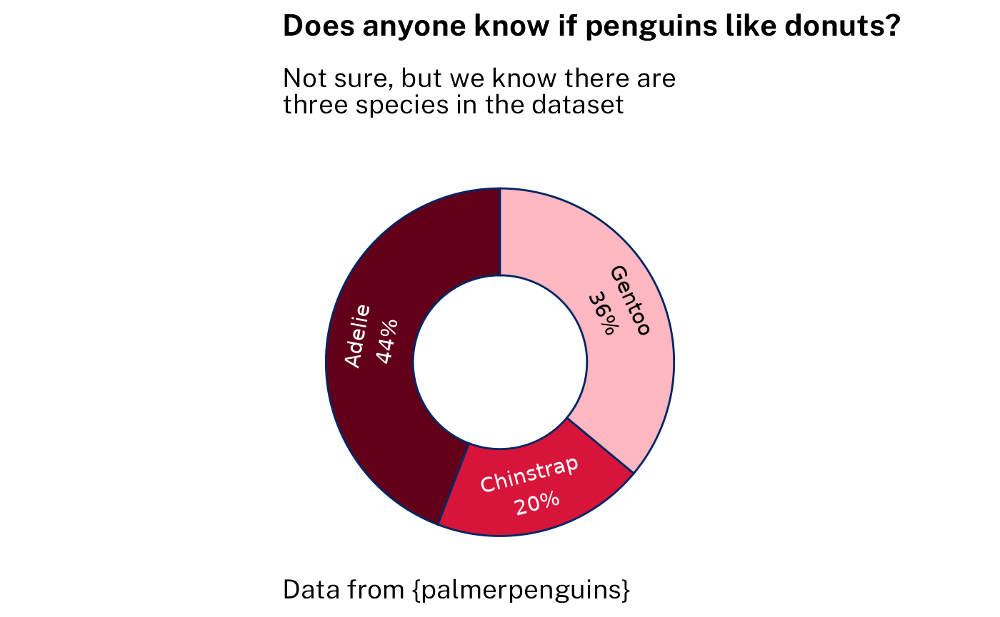
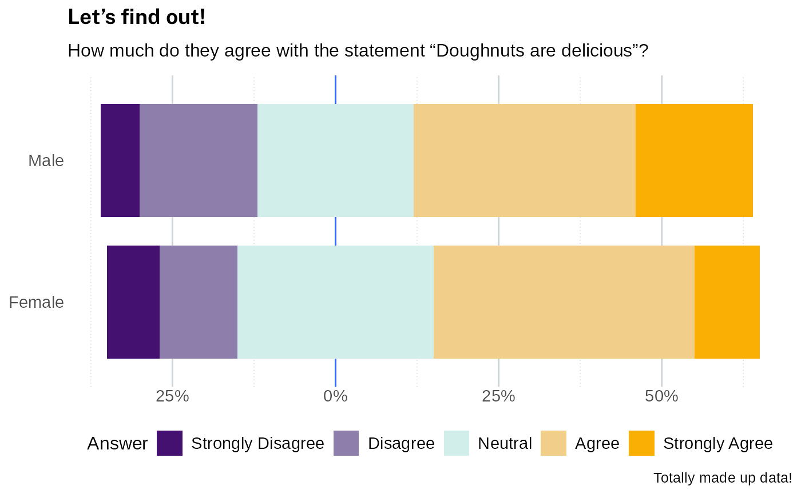

# waratah

## Fonts

The NSW Government typeface is Public Sans. Recommendations:

- [Install the font](https://digitalnsw.github.io/public-sans/download/)
  on your computer. This package will attempt to register an embedded
  copy of the font so that it can be used even without installing the
  font first.
- If possible you should use a graphics device that supports modern
  features such as
  [`ragg::agg_png()`](https://ragg.r-lib.org/reference/agg_png.html).
  These devices should be used by default by RStudio if {ragg} is
  installed.
- If using HTML output (such as for interactive plots of tables), ensure
  that the document loads [Public Sans from Google
  Fonts](https://fonts.google.com/specimen/Public+Sans?preview.script=Latn)
  (see below).

Show font import code for HTML documents.

Either add this to `<head>`:

``` html
<link href="https://fonts.googleapis.com/css2?family=Public+Sans:ital,wght@0,400;0,700;1,400&display=swap" rel="stylesheet">
```

or add this to your CSS:

``` css
@import url('https://fonts.googleapis.com/css2?family=Public+Sans:ital,wght@0,400;0,700;1,400&display=swap');
```

## Example 1

With standard ggplot output:

``` r
library(waratah)
library(palmerpenguins)
library(ggplot2)
library(dplyr)

long_text <- paste(
  c(
    "Lorem ipsum dolor sit amet, consectetur adipiscing elit, sed do",
    "eiusmod tempor incididunt ut labore et dolore magna aliqua. Ut enim",
    "ad minim veniam, quis nostrud exercitation ullamco laboris nisi ut",
    "aliquip ex ea commodo consequat."
  ),
  collapse = " "
)

p1 <-
  ggplot(penguins) +
  geom_point(aes(
    x = bill_length_mm,
    y = flipper_length_mm,
    colour = species,
    size = body_mass_g
  )) +
  labs(
    title = "Let's try some *italics* in the title",
    subtitle = long_text,
    dictionary = c(
      bill_length_mm = "Bill length (mm)",
      flipper_length_mm = "Flipper length (mm)",
      species = "Species",
      body_mass_g = "Body mass (g)"
    ),
    caption = "Data from {palmerpenguins}"
  )

p1
#> Warning: Removed 2 rows containing missing values or values outside the scale range
#> (`geom_point()`).
```


Styling using waratah package - just 2 extra lines of code:

``` r
p1 +
  scale_colour_discrete(palette = pal_nsw()) +
  theme_waratah()
#> Warning: Removed 2 rows containing missing values or values outside the scale range
#> (`geom_point()`).
```


Additional styling using waratah package - specify a palette from the
package:

``` r
p1 +
  scale_colour_discrete(palette = pal_nsw(hue = "blues")) +
  theme_waratah()
#> Warning: Removed 2 rows containing missing values or values outside the scale range
#> (`geom_point()`).
```


## Example 2

With standard ggplot output:

``` r
p2 <-
  filter_out(penguins, is.na(sex)) |>
  ggplot() +
  geom_point(
    aes(
      x = bill_length_mm,
      y = bill_depth_mm,
      fill = interaction(sex, species),
    ),
    shape = 21,
    size = 3,
    colour = "black",
    alpha = 0.8
  ) +
  labs(
    title = "Penguin bill dimensions",
    subtitle = "Separated by *species* and *sex*",
    dictionary = c(
      bill_length_mm = "Bill length (mm)",
      bill_depth_mm = "Bill depth (mm)"
    ),
    caption = "Data from {palmerpenguins}"
  ) +
  guides(
    fill = legendry::guide_legend_group(
      title = NULL,
      ncol = 1,
      direction = "horizontal",
      override.aes = list(size = 3)
    )
  )

p2 + scale_fill_brewer(palette = "Paired")
```


Styling using waratah package - specifying the palette:

``` r
p2 +
  discrete_scale(
    "fill",
    palette = pal_paired(waratah:::nsw_palettes$default)
  ) +
  theme_waratah()
```


Additional styling examples specifying font size, reversing colour
palette:

``` r
p2 +
  scale_fill_discrete(palette = pal_nsw(hue = "purples", variant = "aboriginal")) +
  theme_waratah(base_text_size = 14)
#> Warning: This manual palette can handle a maximum of 4 values. You have
#> supplied 6
```



## Example 3

With standard ggplot output

``` r
p3 <-
  filter_out(penguins, is.na(sex)) |>
  ggplot(aes(x = species, fill = island)) +
  geom_bar() +
  labs(
    dictionary = c(species = "Species", island = "Island"),
    title = "Perfectly proportional penguins",
    subtitle = "Where do they all live?",
    caption = "Data from {palmerpenguins}"
  ) +
  facet_wrap(vars(sex))

p3
```


Styling using the waratah package - specifying pallete, removing the off
white background and adjusting font size

``` r
p3 +
  scale_fill_discrete(palette = pal_nsw(hue = "purples")) +
  theme_waratah(
    background_colour = FALSE,
    base_text_size = 14
  ) +
  guides(x = guide_axis(angle = 70)) +
  theme(
    panel.grid.major.x = element_blank()
  )
```



## Example 4

With standard ggplot output:

``` r
p4 <-
  ggplot(penguins) +
  geom_bar(aes(1, fill = species)) +
  geom_text(
    aes(
      1,
      y = after_stat(count),
      label = stage(
        species,
        after_stat = sprintf("%s\n%.0f%%", label, 100 * count / sum(count))
      ),
      colour = stage(
        species,
        after_scale = col_contrasting(colour)
      )
    ),
    stat = "count",
    position = position_stack(vjust = .5),
    show.legend = FALSE
  ) +
  coord_radial(
    theta = "y",
    inner.radius = .5,
    expand = FALSE,
    rotate.angle = TRUE
  ) +
  labs(
    title = "Does anyone know if penguins like donuts?",
    subtitle = "Not sure, but we know there are three species in the dataset",
    caption = "Data from {palmerpenguins}"
  )

p4
```



Styling using the waratah package - making the background void, removing
off white background, font size:

``` r
p4 +
  scale_fill_discrete(
    aesthetics = c("fill", "colour"),
    palette = pal_nsw(hue = "reds"),
    guide = "none"
  ) +
  theme_waratah(
    void = TRUE,
    base_text_size = 14,
    background_colour = FALSE
  )
```



## Example 5

With standard ggplot output:

``` r
sentiment <- c(
  "Strongly Disagree",
  "Disagree",
  "Neutral",
  "Agree",
  "Strongly Agree"
)

survey_data <- tibble(
  answer = factor(rep(sentiment, 2), levels = sentiment, ordered = TRUE),
  percent = c(8, 12, 30, 40, 10, 6, 18, 24, 34, 18),
  group = sort(rep(c("Male", "Female"), 5))
)

p5 <-
  ggplot(
    survey_data,
    aes(x = percent, y = group, fill = answer)
  ) +
  geom_vline(aes(xintercept = 0, colour = from_theme(accent))) +
  # note: likert is not a standard stat - it's defined and hidden for this example
  geom_tile(stat = "likert", height = 0.8) +
  labs(
    title = "Let's find out!",
    subtitle = "How much do they agree with the statement \"Doughnuts are delicious\"?",
    caption = "Totally made up data!",
    x = NULL,
    y = NULL,
    fill = "Answer"
  ) +
  theme(
    panel.grid.major.y = element_blank(),
    legend.position = "bottom"
  ) +
  scale_x_continuous(labels = function(x) paste0(abs(x), "%"))

p5 + scale_fill_brewer(palette = "PiYG")
```


Styling using the waratah package - removing background, changing font
size:

``` r
p5 +
  discrete_scale(
    "fill",
    palette = pal_stretch(waratah:::nsw_palettes$neg_to_pos),
    breaks = sentiment
  ) +
  theme_waratah(
    background_colour = FALSE,
    base_text_size = 12
  )
```



## NSW Government logo

The logo is in the package as a PNG file - to view it use the following
code:

``` r
library(magick)
#> Linking to ImageMagick 6.9.12.98
#> Enabled features: fontconfig, freetype, fftw, heic, lcms, pango, raw, webp, x11
#> Disabled features: cairo, ghostscript, rsvg
#> Using 4 threads
image_path <- system.file(
  "images",
  "nsw-gov-logo-primary.png",
  package = "waratah"
)
image_read(image_path)
```


