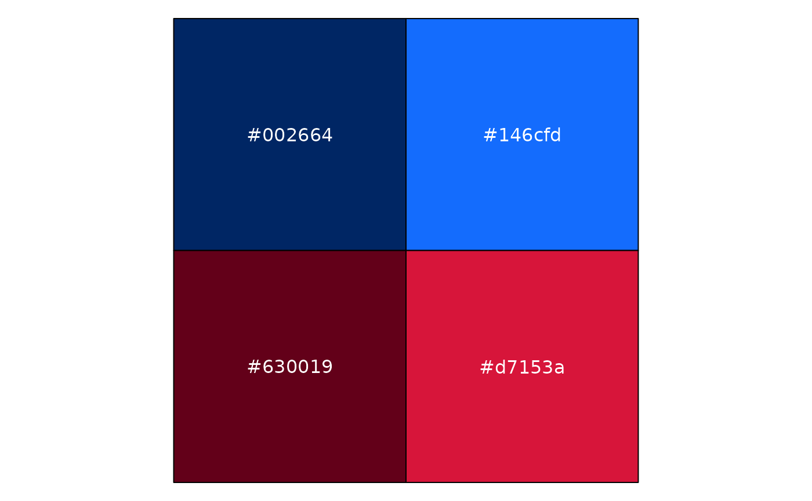
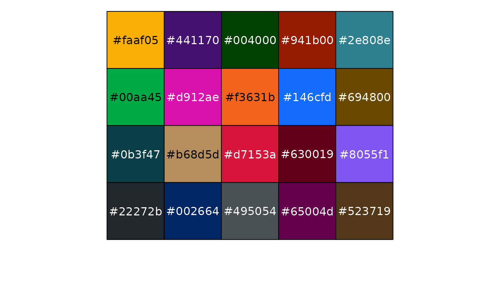
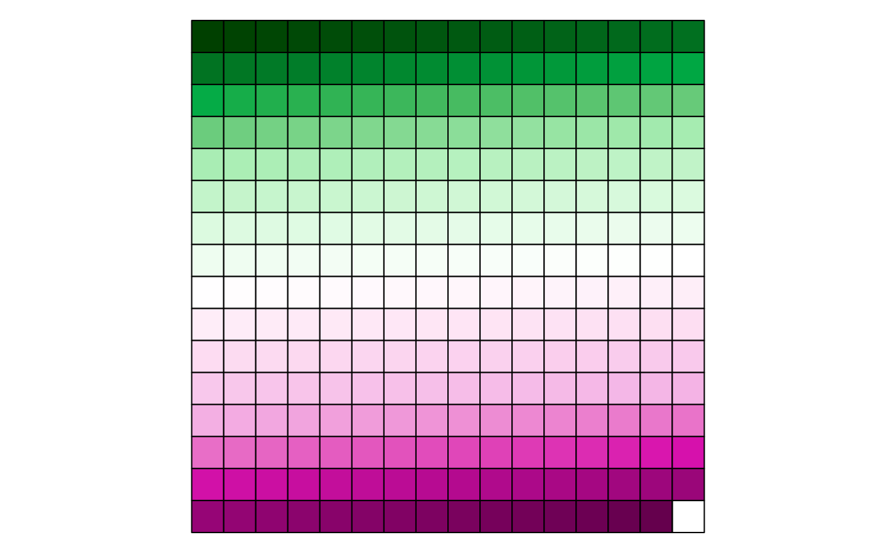
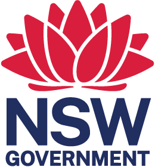

# waratah

## Fonts

The NSW Government typeface is Public Sans. Recommendations:

- [Install the font](https://digitalnsw.github.io/public-sans/download/)
  on your computer. This package will attempt to register an embedded
  copy of the font so that it can be used even without installing the
  font first.
- If possible you should use a graphics device that supports modern
  features such as
  [`ragg::agg_png()`](https://ragg.r-lib.org/reference/agg_png.html).
  These devices should be used by default by RStudio if {ragg} is
  installed.
- If using HTML output (such as for interactive plots of tables), ensure
  that the document loads [Public Sans from Google
  Fonts](https://fonts.google.com/specimen/Public+Sans?preview.script=Latn)
  (see below).

Show font import code for HTML documents.

Either add this to `<head>`:

``` html
<link href="https://fonts.googleapis.com/css2?family=Public+Sans:ital,wght@0,400;0,700;1,400&display=swap" rel="stylesheet">
```

or add this to your CSS:

``` css
@import url('https://fonts.googleapis.com/css2?family=Public+Sans:ital,wght@0,400;0,700;1,400&display=swap');
```

## Theme for ggplot2

[`theme_waratah()`](https://digitalnsw.github.io/nsw-r-visualisations/reference/theme_waratah.md)
sets default fonts, styles, and colour palettes for plots. You can set
the theme globally with
[`ggplot2::set_theme()`](https://ggplot2.tidyverse.org/reference/get_theme.html)
or add it to an individual plot. If using any global options like
`options(waratah.colour_theme = "aboriginal")`, make sure to do this
before setting the theme.

See
[`vignette("cookbook")`](https://digitalnsw.github.io/nsw-r-visualisations/articles/cookbook.md)
for some examples of using the theme.

## Colours

The NSW palettes are designed around two grids consisting of colour
columns and tonal rows. [Guidelines for
charts](https://designsystem.nsw.gov.au/docs/content/methods/charts-and-graphs.html)
suggest techniques for ensuring good contrast so that your charts are
accessible.

Individual colours are available by name, e.g. `nsw_colours$blue_01`.

### Grid-based method

To access colours using the grid system, use
[`pal_nsw()`](https://digitalnsw.github.io/nsw-r-visualisations/reference/pal_nsw.md).
We can visualise the colours with a utility from the scales package:

``` r
pal_nsw(hue = c("blue", "red"), tone = 1:2) |> scales::show_col()
```



This gave us the first two tones of blue followed by the first two tones
of red. Importantly,
[`pal_nsw()`](https://digitalnsw.github.io/nsw-r-visualisations/reference/pal_nsw.md)
always provides a discrete colour palette.

To use that with ggplot as a discrete colour scale, you can use:

``` r
scale_colour_discrete(palette = pal_nsw(hue = c("blue", "red"), tone = 1:2))
```

or
[`scale_fill_discrete()`](https://ggplot2.tidyverse.org/reference/scale_colour_discrete.html)
to set the fill scale. In case you need a continuous scale, ggplot will
automatically interpolate the colours:

``` r
scale_colour_continuous(palette = pal_nsw(hue = "blue"))
```

### Flexible palettes

Instead of working directly with the grid, you can instead use
[`pal_waratah()`](https://digitalnsw.github.io/nsw-r-visualisations/reference/pal_waratah.md).
Specify the pattern of your data and you will get a reasonable discrete
or continous scale. Note that this makes it harder to follow the chat
recommendations mentioned above, but it can be more convenient for
scientific data visualisation.

For qualitative data, a mix of tonal rows 1 and 2 are chosen to avoid
overly-similar colours:

``` r
pal_waratah("qual") |> scales::show_col()
```



There are also palettes for sequential and diverging continuous data
that allow a choice of the base hue:

``` r
pal_waratah("div", hue = "green") |> scales::show_col(labels = FALSE)
```



Because
[`pal_waratah()`](https://digitalnsw.github.io/nsw-r-visualisations/reference/pal_waratah.md)
considers colour similarity, you can request that it also take into
account colour vision disorders:

``` r
pal_waratah("div", hue = "green", cvd = TRUE) |> scales::show_col(labels = FALSE)
```


To make that choice globally, set:

``` r
options(waratah.cvd = TRUE)
```

### Colour themes

Colour palettes in waratah allow a variant to be specified, including
the default `variant = "base"` and the Aboriginal palette
`variant = "aboriginal"`. See
[`pal_nsw()`](https://digitalnsw.github.io/nsw-r-visualisations/reference/pal_nsw.md)
for details.

## NSW Government logo

The logo is included in PNG format:

``` r
library(magick)
#> Linking to ImageMagick 6.9.12.98
#> Enabled features: fontconfig, freetype, fftw, heic, lcms, pango, raw, webp, x11
#> Disabled features: cairo, ghostscript, rsvg
#> Using 4 threads
image_path <- system.file(
  "images",
  "nsw-gov-logo-primary.png",
  package = "waratah"
)
image_read(image_path)
```


