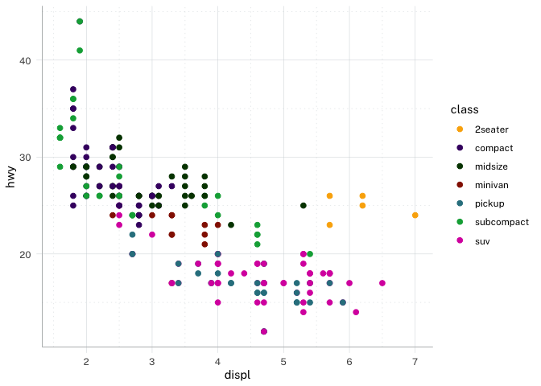

# waratah

The goal of `waratah` is to provide a R tool kit for styles, patterns
and standards following the [Digital NSW, NSW Design
System](https://github.com/digitalnsw/nsw-design-system)

## Installation

You can install waratah like so:

``` r
# CRAN release (not yet!)
# install.packages('waratah')

# development version
install.packages('pak')
pak::pak('digitalnsw/nsw-r-visualisations')
```

## Usage

In many instances it may be sufficient to set the global theme:

``` r
library(ggplot2)
library(waratah)

set_theme(theme_waratah())

ggplot(mpg, aes(displ, hwy, colour = class)) +
  geom_point()
```



More control is available through palette functions such as
[`pal_waratah()`](https://digitalnsw.github.io/nsw-r-visualisations/reference/pal_waratah.md).
See
[`vignette("waratah")`](https://digitalnsw.github.io/nsw-r-visualisations/articles/waratah.md)
for usage guidelines.
