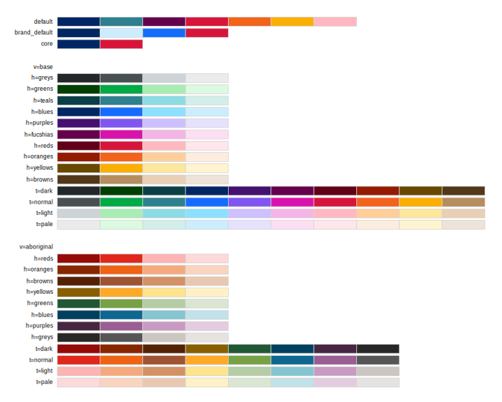

# NSW Design System colour palettes

Palettes created using the [NSW Design
System](https://designsystem.nsw.gov.au/docs/content/design/theming.html).
To use the Aboriginal colour grid, specify `variant = "aboriginal"`.


## Usage

``` r
pal_nsw(
  palette = waiver(),
  hue = NA,
  tone = NA,
  variant = getOption("waratah.colour_theme", default = "base"),
  direction = 1
)

pal_nsw_manual(colours)
```

## Arguments

- palette:

  name of a predefined palette: default, brand_default, core.

- hue:

  name or index of the hue - see below. Ignored if `palette` is
  specified.

- tone:

  name or index of the tone - see below. Ignored if `palette` is
  specified.

- variant:

  name of palette variant. Available options are: base, aboriginal,
  corporate, treasury. Ignored unless `hue` or `tone` is specified.

- direction:

  set to -1 to reverse the order of colours in the palette, or 1 for the
  original order.

- colours:

  vector of colour names corresponding to
  [nsw_colours](https://digitalnsw.github.io/nsw-r-visualisations/reference/col_nsw.md).

## Value

A palette object (see [palette
constructors](https://scales.r-lib.org/reference/new_continuous_palette.html))

## Details

To use palettes based on the NSW Design System colour grids, either
specify `hue` and allow the tone to vary, or specify `tone` to allow the
hue to vary. The recommendation is to use the first two tonal rows going
one colour at a time from a set of colours; this can be achieved by
specifying `tone = 1:2`.

There are several named palettes which can be specified with `palette`.
To create custom combinations of named colours from the design system,
use `pal_nsw_manual()`.

## Colour columns and tonal rows

The `"base"` variant supports:

- **hue**: greys, greens, teals, blues, purples, fucshias, reds,
  oranges, yellows, browns

- **tone**: dark, normal, light, pale

The `"aboriginal"` variant supports:

- **hue**: reds, oranges, browns, yellows, greens, blues, purples, greys

- **tone**: dark, normal, light, pale

Colour themes support subsets of the hues from one of the main grids in
a specific order. These themes are built in:

- `"treasury"`: teals, greys, oranges, greens

- `"corporate"`: blues, reds, greys

The default variant can be specified globally with
`options(waratah.colour_theme)`.

Unambiguous shortened forms are accepted, e.g.
`pal_nsw(h = "red", v = "a")`.

## See also

[`col_nsw()`](https://digitalnsw.github.io/nsw-r-visualisations/reference/col_nsw.md)

Other palettes:
[`pal_waratah()`](https://digitalnsw.github.io/nsw-r-visualisations/reference/pal_waratah.md)

## Examples

``` r
library(scales)

pal_nsw() |> show_col()

pal_nsw(hue = "blues") |> show_col()

pal_nsw(tone = 1:2, variant = "corporate") |> show_col()

pal_nsw(tone = "light") |> show_col()

pal_nsw(tone = "normal", variant = "aboriginal") |> show_col()

pal_nsw_manual(c("blue_02", "red_01", "green_03")) |> show_col()


# you can interpolate colours by converting to a continuous scale
pal_nsw(hue = "blues") |> as_continuous_pal() |> show_col(labels = FALSE)
```
